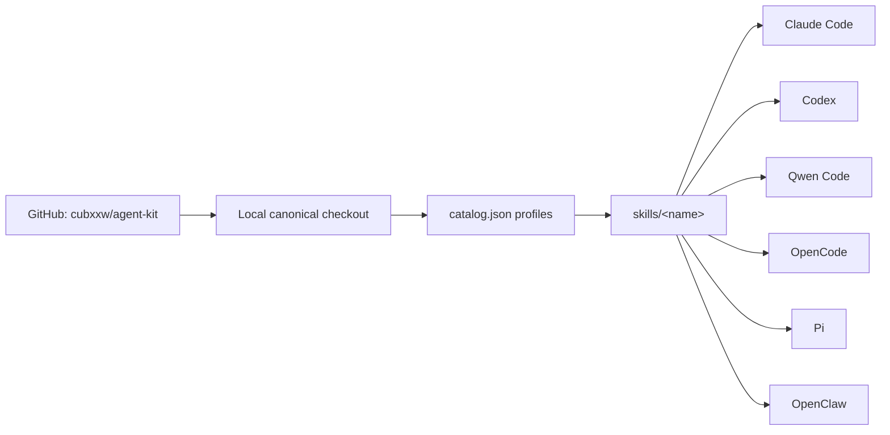

<div align="center">

<h1>agent-kit</h1>

<p><strong>One public source of truth for every coding agent.</strong></p>

<p>
Bootstrap or upgrade a clean, reviewed Agent Skills setup on any laptop or
server—without copying the same skills six times, overwriting local config, or
putting secrets in Git.
</p>

[](https://github.com/cubxxw/agent-kit/actions/workflows/verify.yml)
[](LICENSE)
[](https://agentskills.io/specification)
[](SECURITY.md)

[Give this to your agent](#give-this-to-your-agent) ·
[Install](#install) ·
[Profiles](#profiles) ·
[Top Skills](#top-without-the-bloat) ·
[CC Switch](#agent-kit--cc-switch) ·
[Engineering guide](docs/best-practices.md)

</div>

## Give this to your agent

> [!TIP]
> Paste this single sentence into Claude Code, Codex, Qwen Code, OpenCode, Pi,
> OpenClaw, or another shell-capable coding agent:

```text
Open https://github.com/cubxxw/agent-kit/blob/main/docs/bootstrap.md and follow it end to end to safely initialize or fast-forward upgrade this machine for the current agent; preserve existing configuration and secrets, preview every change, run the verification gates, and report conflicts instead of forcing them.
```

That is the whole handoff. The protocol tells the agent how to detect its host,
pick a profile, protect existing state, install, verify, and report evidence.

## Why agent-kit

Agent setup usually drifts in three places: copied skills diverge, private
runtime config leaks into dotfiles, and a bootstrap script silently replaces
something important. Agent Kit gives those concerns explicit boundaries:

- **One canonical skill tree.** Every supported host sees the same reviewed
  files through symlinks.
- **Safe repetition.** Install and upgrade are idempotent, dry-runnable, and
  refuse copied directories or foreign links.
- **Curated defaults, broad radar.** Popularity helps discovery; license,
  current value, non-overlap, and executable review decide installation.
- **Public/private separation.** Skills, safe instructions, hooks, source pins,
  and templates can be public. Keys, auth, models, sessions, and machine state
  stay local.
- **Verification before trust.** Catalog validation, tests, public-boundary
  scanning, source pins, and host status are part of “done.”

## Install

### Native installer

Best for a machine you control. `core` means Claude Code + Codex; select one
host by name when the agent should configure only itself.

```sh
git clone https://github.com/cubxxw/agent-kit.git "$HOME/.agent-kit"
cd "$HOME/.agent-kit"

./bin/agent-kit doctor --strict
./bin/agent-kit install --profile full-stack --tool core --dry-run
./bin/agent-kit install --profile full-stack --tool core
./bin/agent-kit status --profile full-stack --tool core
```

Supported native targets:

| Agent | `--tool` | Default skill directory |
|---|---|---|
| Claude Code | `claude` | `~/.claude/skills` |
| Codex | `codex` | `~/.agents/skills` |
| Qwen Code | `qwen` | `~/.qwen/skills` |
| OpenCode | `opencode` | `~/.config/opencode/skills` |
| Pi | `pi` | `~/.pi/agent/skills` |
| OpenClaw | `openclaw` | `~/.openclaw/skills` |

Use `--tool all` only when you intentionally want views for all six hosts.

### Open skills ecosystem

The open [`skills`](https://github.com/vercel-labs/skills) CLI reaches 70+
agent integrations and discovers every accepted Agent Kit skill under
`skills/`.

```sh
# Browse before installing
npm exec --yes --package=skills@1.5.21 -- skills add cubxxw/agent-kit --list

# Example: install every accepted skill for one host
npm exec --yes --package=skills@1.5.21 -- \
  skills add cubxxw/agent-kit --global --agent qwen-code --skill '*' --yes
```

Replace `qwen-code` with `claude-code`, `codex`, `opencode`, `pi`, `openclaw`,
or another supported agent identifier.

## Profiles

| Profile | Contents | Use it for |
|---|---|---|
| `base` | `manage-agent-kit` | Minimal server or first bootstrap |
| `developer` | base + `mcp-builder` + `source-driven-development` | Backend, infra, MCP, and source-grounded engineering |
| `design` | base + `deepen-design` + `ui-ux-pro-max` + `design-taste-frontend` | Recursive direction branching, UI/UX intelligence, and anti-slop preflight |
| `prototyping` | base + `boundary-demo` | Disposable boundary experiments and reusable case/eval evidence |
| `full-stack` | developer + design + prototyping | Recommended personal workstation |
| `top` | every broadly useful, fully audited skill | Explicit curated-complete install |
| `all` | compatibility alias for `top` | Existing automation |

[`catalog.json`](catalog.json) is the source of truth. Every third-party entry
records its repository, upstream directory, full commit SHA, tree SHA, and
license.

The design stack has three deliberately separate jobs:

1. `deepen-design` branches product truth, narrative, architecture, and
   composition before implementation.
2. `ui-ux-pro-max` supplies searchable UI/UX and stack-specific evidence.
3. `design-taste-frontend` rejects common frontend clichés at final preflight.

Taste rules alone can remove obvious slop while still converging on a polished
template. Agent Kit therefore never treats a linter, Lighthouse score, or
self-authored design score as proof of distinctiveness.

Give a design Agent this sentence when the first result is merely polished:

```text
Use $deepen-design to audit the rendered interface, branch from product truth into two materially different directions, compare before/A/B evidence with the logo hidden, backtrack when both branches remain generic, and only after selecting an ownable architecture use $ui-ux-pro-max and $design-taste-frontend to implement and preflight it.
```

`boundary-demo` has a different job: turn one uncertain system boundary into a
runnable probe whose cases can outlive its disposable UI. It chooses one of
boundary, logic, or taste mode; seeds normal, edge, and failure cases; separates
observed facts from automated verdicts and human choices; and stops at a
decision. Streamlit is the default medium for Python/data/state probes, not a
requirement. New Streamlit probes get project-local `server.runOnSave = true`,
loopback binding, fake adapters, pytest, and AppTest; technical Streamlit
guidance is loaded from the version installed in that probe.

```text
Use $boundary-demo to answer one uncertain integration or state decision with a disposable demo, visible trace, and normal/edge/failure cases. Stop at supported, rejected, or inconclusive; do not turn it into a production app.
```

## Top, without the bloat

[`docs/top-skills.md`](docs/top-skills.md) organizes high-signal GitHub skill
sources into adopted, on-demand, and discovery-only layers. It covers official
OpenAI, Anthropic, Vercel, Microsoft, Hugging Face, NVIDIA, .NET, Supabase,
Firebase, Prisma, and Remotion sources plus strong specialist and community
collections.

The radar can be broad because it installs nothing. The `top` profile remains
small because every included skill must pass license, source-pin, executable,
overlap, public-boundary, and host-discovery gates.

```sh
./bin/agent-kit install --profile top --tool core --dry-run
./bin/agent-kit install --profile top --tool core
```

## How one source reaches every agent



The host directories are discovery views, not storage. Editing or
fast-forwarding the canonical checkout updates every managed link.

## Agent Kit + CC Switch

These projects solve different layers and work well together:

| Layer | Use | What belongs there |
|---|---|---|
| **Agent Kit** | Public, versioned capability layer | Skills, safe instructions, hook logic, source pins, server bootstrap |
| **[CC Switch](https://github.com/farion1231/cc-switch)** | Private local runtime layer | Providers, API endpoints, keys, models, MCP state, sessions, backups |

In CC Switch, open **Skills → Repository Management → Add Repository**, then
use:

```text
Owner: cubxxw
Name: agent-kit
Branch: main
Subdirectory: skills
```

For one shared source, select `~/.agents/skills` as the CC Switch skill storage
location and use symlink distribution. Keep provider credentials and CC Switch
cloud-sync data out of this repository.

## What is shared—and what never is

| Safe to version | Keep local |
|---|---|
| Agent Skills and supporting data | API keys, tokens, cookies, OAuth state |
| Durable public instructions | Provider, model, billing, and routing choices |
| Deterministic hook logic | Approval history and workspace trust |
| MCP names and environment-variable names | Actual environment-variable values |
| Safe config examples | Sessions, memories, transcripts, caches |
| Source pins, licenses, review records | Private knowledge and machine overrides |

Files under [`config/`](config/) are mergeable examples. They are never a
license to replace an existing `settings.json`, `config.toml`, or agent
instruction file.

## The engineering practices behind it

Agent Kit turns recurring corrections into infrastructure:

1. Keep resident context small; load detailed guidance only when it is needed.
2. Encode repeated mistakes as a rule, test, hook, skill, or script.
3. Make every completion claim return with observable evidence.
4. Preview first, preserve conflicts, and keep changes reversible.
5. Automate the deterministic path; reserve model judgment for real decisions.
6. Review third-party skill code, license, overlap, and source pin before use.

The dated research and trade-offs are documented in
[`docs/best-practices.md`](docs/best-practices.md), drawing from
[Boris Cherny’s workflow thread](https://x.com/bcherny/status/2007179832300581177),
the evolving [How Boris Uses Claude Code](https://howborisusesclaudecode.com/),
[CC Switch](https://github.com/farion1231/cc-switch),
[UI UX Pro Max](https://github.com/nextlevelbuilder/ui-ux-pro-max-skill), and
[Addy Osmani’s Agent Skills](https://github.com/addyosmani/agent-skills), with
[Taste Skill](https://github.com/Leonxlnx/taste-skill) as the reviewed
frontend judgment layer.

## Operate it

```sh
# Safe preview
./bin/agent-kit install --profile full-stack --tool core --dry-run

# Validate repository, catalog, licenses, and public boundary
./bin/agent-kit doctor --strict

# Check managed links
./bin/agent-kit status --profile full-stack --tool core

# Check whether a pinned upstream skill directory changed
./scripts/check_upstreams.py

# Remove only links owned by this checkout
./bin/agent-kit uninstall --profile full-stack --tool core --dry-run
```

For unattended provisioning, set `AGENT_KIT_PROFILE` and `AGENT_KIT_TOOL`, then
run [`scripts/bootstrap.sh`](scripts/bootstrap.sh). It only fast-forwards a
clean checkout.

## Trust, maintenance, and quality

- [Architecture](docs/architecture.md)
- [Bootstrap protocol](docs/bootstrap.md)
- [Maintenance runbook](docs/maintenance.md)
- [Skill selection ledger](docs/skill-selection.md)
- [Top Skills Radar](docs/top-skills.md)
- [Boris-style quality review](docs/quality.md)
- [Security policy](SECURITY.md)
- [Third-party notices](THIRD_PARTY_NOTICES.md)

If this saves you from maintaining the same agent setup six times, consider
starring the repository. It makes the project easier to find without making
the catalog any less selective.

## License

First-party code and documentation are MIT licensed. Vendored skills retain
their upstream licenses and attribution; see
[`THIRD_PARTY_NOTICES.md`](THIRD_PARTY_NOTICES.md).
